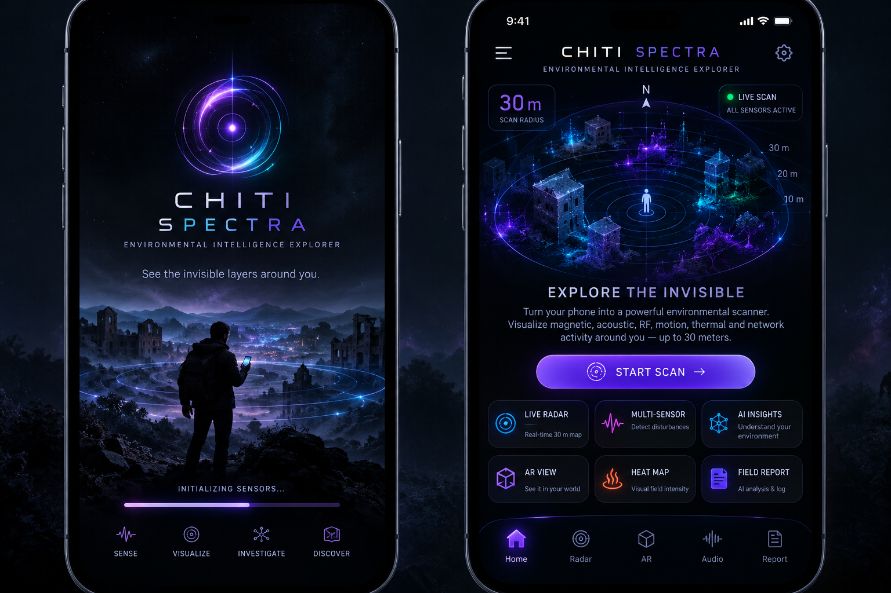
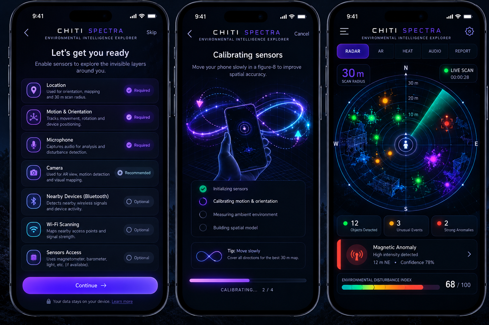

# CHITI SPECTRA

> **A 30-meter Environmental Disturbance Scanner & Intelligence Explorer**  
> *“See the invisible layers around you.”*

---

  
  

## Overview

**CHITI SPECTRA** is a mobile environmental-intelligence explorer built as a native-feel Progressive Web Application (PWA). It transforms your smartphone's onboard hardware sensors into a synchronized, scientific instrument that measures, visualizes, and documents the invisible physical world.

Rather than relying on gimmicky novelty "ghost detector" tropes, **Spectra** is grounded in real physics, sensor fusion, and strict spatial honesty:
- **NASA × Cyberpunk × National Geographic aesthetic**: deep pitch black (#050508), glassmorphic panels, neon cyan (#00f0ff), electric purple (#a855f7), and tactical amber telemetry.
- **Synchronized Multi-Sensor Fusion**: Magnetics, acoustics, device motion/vibration, ambient illumination, and wireless signal density mapped onto a common monotonic timeline.
- **Strict Spatial Honesty**: Clearly separates directly measured values from spatially inferred estimates and unlocated ambient spikes.

---

## 5 Primary Interface Modes

| Mode | Canvas | Description |
| :--- | :--- | :--- |
| **1. Radar** | 30m Circular Canvas | Tactical 30-meter observation zone with rotating sweep beam, concentric range rings (5m, 10m, 20m, 30m), orientation heading (compass), anomaly blips with confidence decay, and walking breadcrumb trail. |
| **2. AR Reticle HUD** | Camera Overlay | Real-time camera feed with a scientific heads-up display, floating disturbance vectors, range estimation brackets, and live sensor telemetry. |
| **3. Heat Field** | 2D Spatial Density | Floor-plan style persistent thermal/density accumulation grid showing where magnetic, acoustic, RF, or vibration anomalies cluster over time. |
| **4. Audio Lab** | Oscilloscope & Waterfall | Real-time 60fps audio waveform, rolling FFT waterfall spectrogram, low-frequency rumble analyzer, and sudden transient impact / knock detector. |
| **5. AI Report & Expedition** | Mission & Evidence Log | Structured field missions (*Map the Room*, *Silent Observer*, *Magnetic Sweep*), automated AI post-session debriefs, and session export (JSON / CSV / Markdown). |

---

## Spatial Honesty Model

A single mobile phone standing still cannot magically triangulate every distant signal. Spectra communicates scientific certainty with three strict classifications:

| Classification | Meaning | Visual Representation |
| :--- | :--- | :--- |
| **Measured** | Directly observed by device hardware at current location | Solid high-contrast point or crisp ring |
| **Estimated** | Position inferred from repeated spatial movement & signal decay | Translucent probability cloud or gradient region |
| **Unknown Origin** | A real physical anomaly occurred but cannot be spatially pinned | Perimeter ring alert, timeline tick, or ambient HUD flash |

---

## Mathematical Formulation: Environmental Disturbance Index (EDI)

$$EDI = w_m M + w_a A + w_r R + w_v V + w_l L + w_n N$$

Where each factor represents a normalized deviation from a rolling locally-learned baseline:
- **M**: Magnetic flux density anomaly ($|B - \mu_B| / \sigma_B$)
- **A**: Acoustic transient / amplitude spike above ambient floor
- **R**: Radio-frequency (Wi-Fi / BLE beacon) density delta
- **V**: Device vibration / acceleration transient ($|a - g|$)
- **L**: Ambient illumination flux
- **N**: Network constellation churn rate

---

## Progressive Web App (PWA) Specifications

To operate seamlessly in field expeditions without app-store barriers, Spectra is engineered as a high-performance native-feel PWA:
- **Display**: Standalone full-screen with notch / Dynamic Island safe-area padding (`viewport-fit=cover`).
- **Screen Wake Lock**: Automatically prevents device sleep during active investigation sessions.
- **Haptic Feedback**: Contextual micro-vibrations for anomaly thresholds and radar sweep crossings (`navigator.vibrate`).
- **Hardware-Accelerated 60 FPS**: Canvas/WebGL rendering for radar beam, heatmaps, and audio spectrograms.
- **Offline First**: Serwist/Workbox service worker cache + IndexedDB for unlimited local session storage and offline field expeditions.

---

## Documentation

- **Full Product Requirements Document**: [PRD.md](./PRD.md)
- **Concept & Design Manifesto**: [New Text Document.txt](./New%20Text%20Document.txt)
- **UI Mockups & Assets**: [`docs/assets/`](./docs/assets/)

---

## License

Proprietary — Chiti Technologies.
